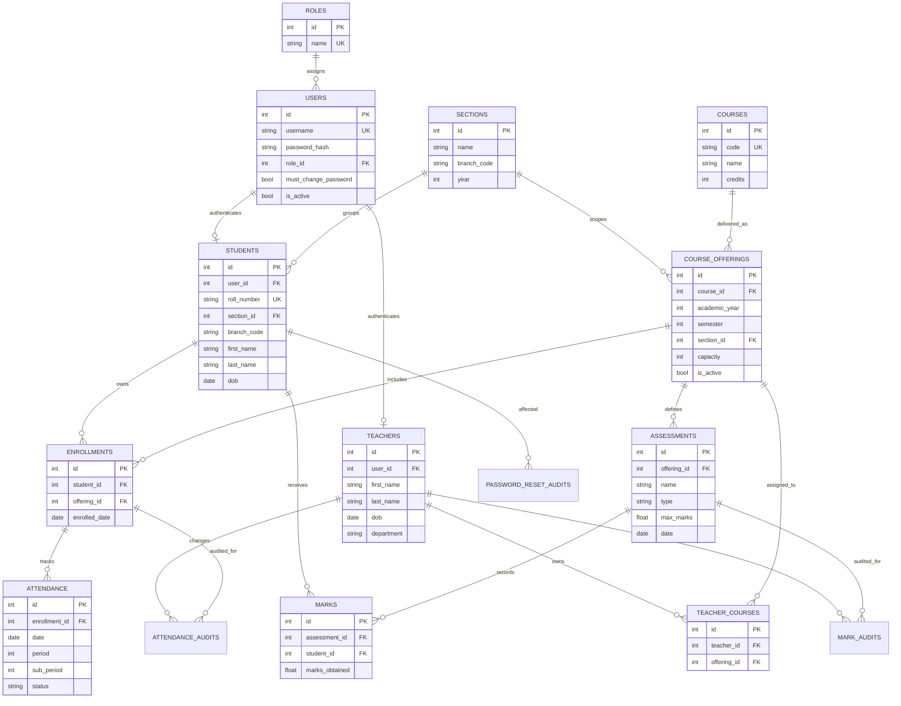

# Schema ERD

```mermaid
erDiagram
    ROLES ||--o{ USERS : assigns
    USERS ||--o| STUDENTS : authenticates
    USERS ||--o| TEACHERS : authenticates
    SECTIONS ||--o{ STUDENTS : groups
    SECTIONS ||--o{ COURSE_OFFERINGS : scopes
    COURSES ||--o{ COURSE_OFFERINGS : delivered_as
    TEACHERS ||--o{ TEACHER_COURSES : owns
    COURSE_OFFERINGS ||--o{ TEACHER_COURSES : assigned_to
    STUDENTS ||--o{ ENROLLMENTS : owns
    COURSE_OFFERINGS ||--o{ ENROLLMENTS : includes
    ENROLLMENTS ||--o{ ATTENDANCE : tracks
    COURSE_OFFERINGS ||--o{ ASSESSMENTS : defines
    STUDENTS ||--o{ MARKS : receives
    ASSESSMENTS ||--o{ MARKS : records
    STUDENTS ||--o{ PASSWORD_RESET_AUDITS : affected
    TEACHERS ||--o{ ATTENDANCE_AUDITS : changes
    ENROLLMENTS ||--o{ ATTENDANCE_AUDITS : audited_for
    TEACHERS ||--o{ MARK_AUDITS : changes
    ASSESSMENTS ||--o{ MARK_AUDITS : audited_for

    ROLES {
        int id PK
        string name UK
    }
    USERS {
        int id PK
        string username UK
        string password_hash
        int role_id FK
        bool must_change_password
        bool is_active
    }
    STUDENTS {
        int id PK
        int user_id FK
        string roll_number UK
        int section_id FK
        string branch_code
        string first_name
        string last_name
        date dob
    }
    TEACHERS {
        int id PK
        int user_id FK
        string first_name
        string last_name
        date dob
        string department
    }
    SECTIONS {
        int id PK
        string name
        string branch_code
        int year
    }
    COURSES {
        int id PK
        string code UK
        string name
        int credits
    }
    COURSE_OFFERINGS {
        int id PK
        int course_id FK
        int academic_year
        int semester
        int section_id FK
        int capacity
        bool is_active
    }
    TEACHER_COURSES {
        int id PK
        int teacher_id FK
        int offering_id FK
    }
    ENROLLMENTS {
        int id PK
        int student_id FK
        int offering_id FK
        date enrolled_date
    }
    ATTENDANCE {
        int id PK
        int enrollment_id FK
        date date
        int period
        int sub_period
        string status
    }
    ASSESSMENTS {
        int id PK
        int offering_id FK
        string name
        string type
        float max_marks
        date date
    }
    MARKS {
        int id PK
        int assessment_id FK
        int student_id FK
        float marks_obtained
    }
```
